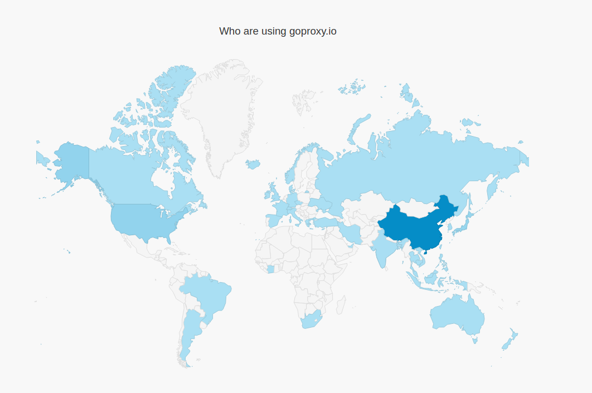

# golang

> 本项目使用的是go1.12

golang 官网 https://golang.org; 

墙内用户可在这里下载: https://golang.google.cn/dl/

> 为了加快下载go包速度, 建议使用go mod代理:
将`export GOPROXY=https://goproxy.io` 加入到 `~/.bashrc`文件.
这是一个免费公共代理, 更多信息, 可访问 https://goproxy.io/ 下面是官网截图, 有意思了

